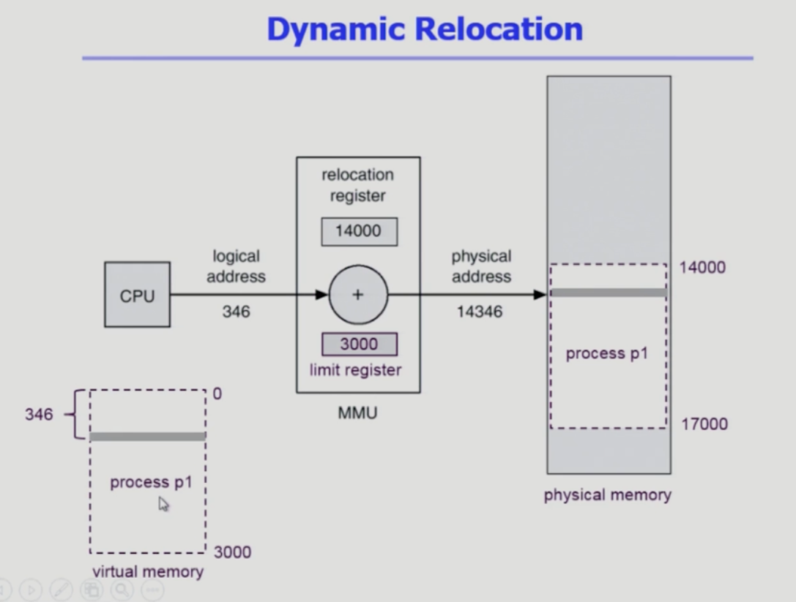
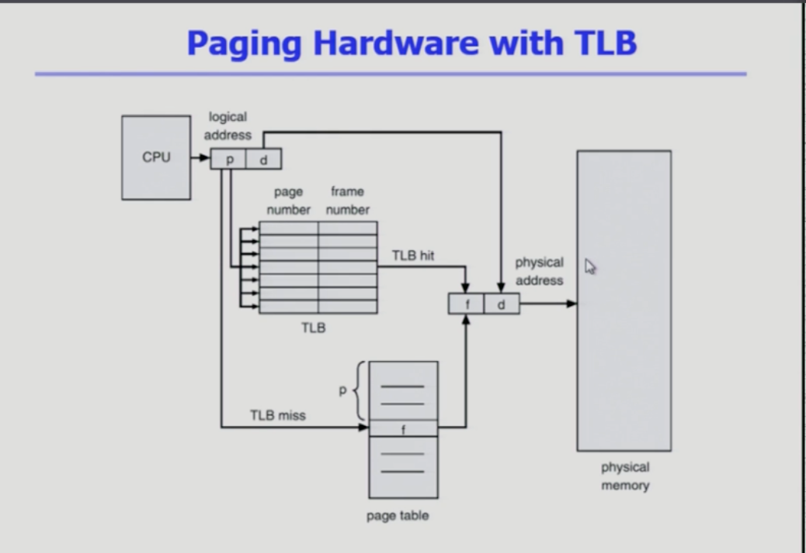
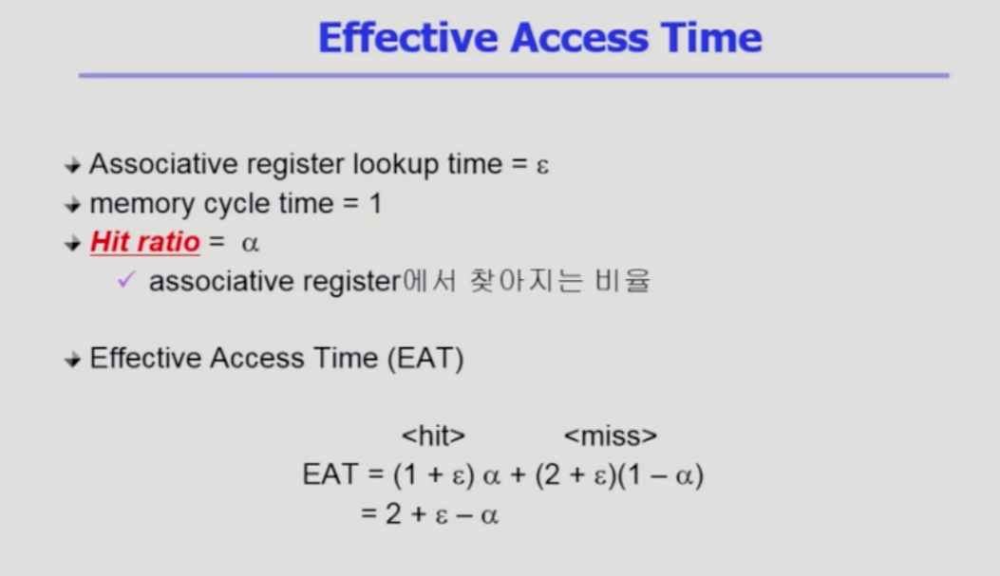

# Memory
### Logical address
프로세스마다 독립적으로 가지는 주소 공간 
### physical address
메모리에 실제 올라가는 위치
### 주소 바인딩
symbolic add -> logic -> physical
소스 코드 컴파일 -> 논리 주소 -> 물리 주소
물리적 메모리 주소가 컴파일 시 알려짐 
컴파일러는 절대 코드 생성
cpu가 바라보고있는 주소는 논리적 주소

CPU가 주소를 참조할 때마다 binding을 점검 하드웨어의 지원이 필요하다(MMU Memory Management Unit)

### Dynamic Loading 
프로세스 전체를 메모리에 미리 다 올리는 것이 아니라 해당 루틴이 불려질 떄 메모리에 load하는 것
memory utilization이 향상
### Overlays
메모리에 프로세스의 부분 중 실제 필요한 정보만을 올린다.
### Swapping
프로세스를 일시적으로 메모리에서 backing store로 쫓아내는 것
**swap area = backing store**
runtime binding을 사용해야 효율적으로 메모리를 사용할 수 있음
### Dynamic Linking(.so, .dll)
Linking을 실행 시간까지 미루는 기법
- static linking
라이브러리가 프로그램의 실행 파일 코드에 포함됨
실행 파일에 크기가 커짐
- Dynamic linking

### 연속 메모리 할당
- 고정 분할 방식
처음에 조각의 크기를 크게 할당해 놓게되면 메모리를 효율적으로 사용할 수 없음
- 가변 분할 방식
### Hole(가용 메모리 공간)
다양한 크기의 hole들이 메모리 여러 곳에 흩어져있다.
Dynamic Storage Allocation Problem
- First Fit
n이상인 것 중 최초로 찾아지는 hole에 할당
- Best Fit
n이상인 가장 작은 hole에 할당
모든 hole 리스트를 탐색 해야한다
- Worst fit
가장 큰 hole에 할당하게 된다.

### Compaction 
사용 중인 메모리 영역을 한군데로 몰고 hole들을 다른 한 곳을 몰아 큰 block을 만드는 것

## Paging
프로세스의 가상 메모리를 동일한 사이즈의 page로 나눈다. 
