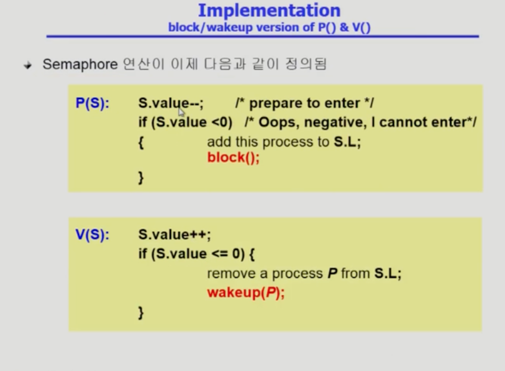

# Process Synchronization

## Race Condition
하나의 공유 자원을 여러 프로세스가 접근하는 경우 Race Condition이 발생한다.

### OS에서 race conditiondms 언제 발생할까? 
1. kernel 수행 중 인터럽트 발생시
2. Process가 시스템콜 하여 커널모드로 수행 중인데 문맥 교환이 일어나는 경우
3. 다중 CPU의 경우

- 두 프로세스의 address space 간에는 data sharing이 없음
- 그러나 시스템 콜 하는 동안에는 kernel 주소 공강늬 data에 접근하게 된다.

**해결책** 
커널 모드에서 수행 중일떄는 CPU를 뻇지 않는다. 커널 모드에서 사용자 모드로 돌아갈때 프로세스를 뺏는다

### 다중 CPU의 경우
한 번에 하나의 CPU만이 커널에 들어갈 수 있게 하는 방법
커널 내부에 있는 각 공유 데이터에 접근 할때마다 그 데이터에 대한 lock / unlock을 하는 방법

## Process Synchronization

각 프로세스에 code segment에는 공유 데이터를 접근하는 코드인 critical section(임계 구역)이 있음.

### 임계 구역의 접근
- Algorithm 1

1. 상호 배제
다른 프로세스가 critical section 부분을 수행 중이면 다른 모든 프로세스들은 그들의 critical section에 들어가면 안된다.
2. 진행
아무도 critical section에 있지 않는 상태에서는 프로세스가 접근할 수 있다.
3. 유한 대기 
무한적으로 critical section에 접근 할 수 없으면 안된다.
- Algorithm 2

- Algorithm 3

### Synchronization Hardware
하드웨어 적으로 Test & modify를 atomic하게 수행할 수 있도록 지원하는 경우 앞의 문제는 간단히 해결

### Semaphores

busy - wait 문제에는 효율적이지 못하다.
### Block / Wakeup

### Busy Wait vs Block / wakeup
임계구역의 길이가 긴 경우 Block / wakeup이 적당
매우 짧은 경우 busy wait
일반적인 경우에는 Block/wakeup방식이 더 좋음

## Deadlock 과 Starvation
### Deadlock
둘 이상의 프로세스가 서로 상대방에 의해 충족될 수 있는 event를 무한히 기다리는 현상

## Synchronization의 전통적인 문제
### Bounded Buffer 문제

### 두 가지의 Semaphores
- Counting semaphore
- Binary Semaphore

### Reader - Writers Problem

Reader들이 한꺼번에 접근하는 경우 write의 starvation이 발생할 수 있다.

### Dining - Philosopheres Problem(식사하는 철학자 문제)
데드락의 발생 가능성이 있다.
젓가락을 두 개 모두 집을 수 있을 때만 젓가락을 집을 수 있게 한다.

## Monitor
Semaphore의 한계 
- 구현 복잡성
- 정확성의 입증이 어렵다
- 한번의 실수가 모든 시스템에 치명적 영향

위와 같은 한계를 극복하기 위하여 Monito r 방식을 사용하게 된다.
동시 수행중인 프로세스 사이에서 abstract data type의 안전한 공유를 보장하기 위한 high level synchronization construct

condition x, y 변수를 둔다. 

## Deadlock(교착상태)
일련의 프로세스들이 서로가 가진 자원을 기다리며 block된 상태

- Resource(자원)
하드웨어, 소프트웨어 등을 포함하는 개념

## 발생하는 조건
- 상호 배타적 자원
매 순간 하나의 프로세스만이 자원을 사용할 수 있음
- 비선점
프로세스는 자원을 스스로 내어놓고 강제로 빼앗기지 않음
- hold & wait
보유 자원을 놓지 않고 계속 가지고 있음
- Circular wait
자원을 기다리는 프로세스 간에 사이클이 형성되어야함

## 처리할 수 있는 방법
### deadlock prevention
1. 상호배타적 자원
    - 공유해서는 안되는 자원의 경우 반드시 성립해야함

2. Hold & wait    
    프로세스가 자원을 요청할 때 다른 어떤 자원도 가지고 있지 않아야한다. 
    1. 프로세스 시작 시 모든 필요한 자원을 할당받게 하는 방법
    2. 자원이 필요할 경우 보유 자원을 모두 놓고 다시 요청
3. 비선점
    - state를 쉽게 save하고 restore할 수 있는 자원에서 주로 사용
4. circular wait
    - 모든 자원 유형에 할당 순서를 정하여 정해진 순서로만 자원 할당     
### deadlock avoidance
 자원 요청에 대한 부가정보를 이용해서 자원 할당이 dead lock으로부터 안전한지를 동적으로 조사해서 안전한 경우에만 할당
### deadlock detection recovery
- recovery 
    1. Process 종료
    2. 하나씩 종료하는 방법
### deadlock ignorance
Deadlock을 운영체제에서 아무런 조치도 취하지 않는 방법