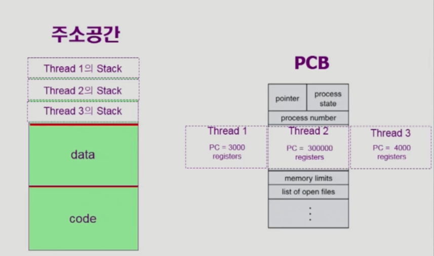

# Process
## Virtual Memory
각각의 프로세스는 Virtual Memory에 주소공간을 갖게된다. 
논리적 주소(가상 메모리의 주소), 물리적 주소(실제 메모리의 주소)의 변환하는 과정이 필요하다.
- stack 
함수를 호출했을때와 return 했을때 되돌아가는 위치
- data
배열, 메모리, 전역변수
- code
main 함수, 사용자 함수, 지역변수

### 커널 주소공간의 내용
- code
시스템 콜, 인터럽트 처리 코드
자원 관리를 위한 코드
서비스 제공을 위한 코드
- data
하드웨어들을 관리하기 위한 자료구조
**PCB**: 현재 진행중인 프로세스의 관련된 자료구조
- stack
각 프로세스마다 별도의 커널 스택을 가지고 있다.

### 사용자 프로그램이 사용하는 함수
- 사용자 정의 함수
- 라이브러리 함수
프로그램의 실행 파일에 포함되어 있다.
- 커널 함수
운영체제 프로그램의 함수
커널 함수의 호출 = 시스템 콜


## 프로그램의 실행(메모리 Load)


## 프로세스의 개념 
### 프로세스의 문맥
1. CPU 수행 상태를 나타내는 하드웨어 문맥
- Program Counter cpu가 어떤 프로세스의 주소값을 가지고 있는지
- 각종 register

2. 프로세스의 주소공간
- code
- data
- stack

3. 프로세스 관련 커널 자료 구조
- PCB
각 프로세스의 진행 상황에 대한 자료구조
- Kernal Stack
프로세스의 현재 상태를 나타내는 kernal stack

## 프로세스의 상태
Running: cpu가 사용중인 상태
Ready: CPU 할당을 기다리고 있는 상태
Blocked: CPU를 주어도 당장 연산을 수행할 수 없는 상태
- disk file 불러오는 경우 
- 프로세스의 이벤트가 만족되지 않는 경우
Suspended: 외부적인 이유로 프로세스의 수행이 정지된 상태
프로세스는 통쨰로 디스크에 swap out 된다.
 


## PCB
운영체제가 각 프로세스를 관리하기 위해 프로세스당 유지하는 정보
1. 관리상 사용하는 정보
- 프로세스 상태
- PID
- Scheduling information
- 우선순위
2. CPU 수행 관련 하드웨어값
3. 메모리 관련
4. 파일 관련

### 문맥교환
CPU를 한 프로세스에서 다른 프로세스로 넘겨주는 과정
- CPU를 내어주는 프로세스의 상태를 그 프로세스의 PCB에 저장
- CPU를 새롭게얻는 프로세스의 상태를 PCB에서 읽어옴 

### 스케쥴러
- 장기 스케쥴러
시작 프로세스 중 어떤 것들을 ready queue로 보낼 지 결정
프로세스에 memory를 주는 문제
- 단기 스케쥴러
어떤 프로세스를 다음번에 running 시킬지 결정
프로세스에 CPU를 제공하는 스케쥴러
- 중기 스케쥴러
여유 공간 마련을 위해 프로세스를 통째로 메모리에서 디스크로 쫒아냄


## Thread

CPU의 수행 단위 
stack space이외(code, data section) 부분은 공유하게 된다. 
모든 프로세스들을 분리하게되면 context switching이 과도한 overhead를 불러올 수 있기 때문에 공유할 수 있는 부분은 공유하되, 각각의 PC 주소만 stack부분에 저장해서 쓰레드로 관리할 수 있다.

### Thread의 장점
- 빠른 응답성
- 자원 공유의 효과
- 효율적
프로세스를 만드는 것에 비해서 쓰레드를 만드는 것이 효율적이다.

### Tread의 구현
- 커널 스레드
- 사용자 스레드 

### 프로세스 생성
부모 프로세스가 자식 프로세스를 생성 프로세스는 트리 계층
프로세스는 자원을 필요로 함
- 운영체제로부터 받는다
- 부모와 공유한다

자원의 공유
- 부모와 자식이 모든 자원을 공유하는 모델
- 일부를 공유하는 모델
- 전혀 공유하지 않는 모델

수행(Execuation)
- 부모와 자식은 공존하며 수행되는 모델
- 자식이 종료될때까지 부모가 기다리는 모델

**주소 공간(Address space)**
- 자식은 부모프로세스의 공간을 복사함
- 자식은 그 공간에 새로운 프로그램을 올림.
fork()를 통해 프로세스의 공간을 복사하고 exec() 시스템콜을 통해 새로운 프로그램을 올린다.

### 프로세스 종료
- 자발적 종료 exit(): 프로세스가 마지막 명령을 수행한 후 운영체제에게 이를 알려줌 
자식이 부모에게 output data를 보낸다. exit()
- 부모가 종료하는 경우 abort()
자식의 할당 자원의 한계치를 넘어섬
자식에게 할당된 테스크를 더이상 필요로 하지 않는다
부모 프로세스가 종료되는 경우. 

## System Call - fork() 
부모 프로세스를(code, data, stack) copy하지만 모든 것을 공유하는 것은 메모리 낭비가 생기기 때문에 공유 메모리를 통해서 공유 하고있음 = **Copy On Write** 
write가 발생하였을때 copy함 부모의 context를 그대로 복사함 프로그램카운터 복제(PC) copy
```
int main()
	int pid;
    pid = fork();
    if(pid == 0)
    	"i am childProcess"
	else if(pid > 0)
    	"i am parentProcess"
```

## System Call - exec() 
```
int main()
	int pid;
    pid = fork();
    if(pid == 0)
    	"i am childProcess"
        execLp("Program name", "Program name", "param1","param2",(char*)0) -> 이 부분에서 새로운 프로그램으로 덮어 씌워진다.
	else if(pid > 0)
    	"i am parentProcess"
```
## System Call - wait()
프로세스 A가 wait을 호출하면
childProcess가 종료될떄까지 A를 sleep시킨다. block -> ready
docker log -f 를 실행시킬떄 -d demon option을 넣어줘야하는이유
>wait()는 부모 프로세스를 BLOCKED 상태로 전환하여, 자식 프로세스가 종료될 때까지 기다립니다.
Docker의 -d 옵션은 컨테이너를 백그라운드에서 실행시켜 터미널 점유를 방지합니다.
따라서, docker log -f로 실시간 로그를 확인하려면 **컨테이너를 백그라운드 모드(-d)**로 실행해야 효율적으로 로그 스트리밍과 다른 작업을 병행할 수 있습니다.


```
int main()
	int pid;
    pid = fork();
    if(pid == 0)
    	"i am childProcess"
        execLp("Program name", "Program name", "param1","param2",(char*)0) -> 이 부분에서 새로운 프로그램으로 덮어 씌워진다.
	else if(pid > 0)
    	"i am parentProcess"
        wait() = sleep()
```
## System Call - exit() 
- 자발적 종료
마지막 statement 수행 후 exit() 시스템콜을 통해
main이 return 될때 컴파일러가 넣어준다. exit됨
- 비자발적 종료 
자식 프로세스가 과도한 리소스를 점유하고있는 경우
키보드 kill break

## 프로세스간 협력
### 독립적 프로세스(independent Process)
프로세스는 각자의 주소 공간을 가지고 수행되므로 원칙적으로 하나의 프로세스는 다른 프로세스의 수행에 영향을 끼치지 못함.
### 협력 프로세스(Cooperating Process)
프로세스 협력매커니즘을 통해 하나의 프로세스가 다른 프로세스의 수행에 영향을 미칠 수 있음.
### 프로세스 간 협력 매커니즘(IPC: Interprocess Communication)
- Message Passing: 커널을 통해 메시지 전달
프로세스 사이에 공유 변수를 일체 사용하지않고 통신하는 시스템
**Direct Communication**
통신하려는 프로세스의 이름을 명시적으로 표시
**Indirect Communication**
port, mailbox를 통해 메시지를 간접 전달

- Shared Memory: 서로 다른 프로세스 간에도 일부 주소 공간을 공유하게하는 shared memory 매커니즘이 있음
- thread: 쓰레드는 사실상 하나의 프로세스이므로 프로세스간 협력으로 보기 어렵지만 쓰레드들끼리는 완전히 공유하고있음.